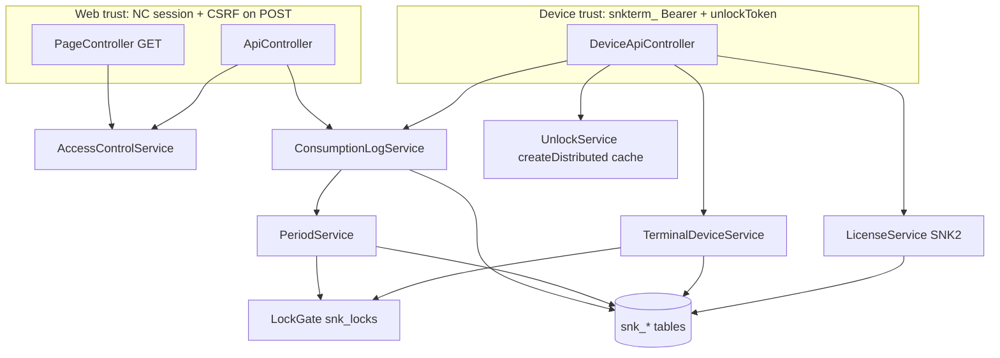

# Zeus Architecture Audit — SnackCheck

> **Review Mode: FULL AUDIT**  
> **Object:** Implemented system `nextcloud/apps/snackcheck` (v1.0.6)  
> **Date:** 2026-08-10 (re-audit after Bachus UX + capacity gate hardening)  
> **Auditor:** Zeus (Chief Architecture Auditor)  
> **Environment:** Host PHPUnit under `nextcloud/apps/snackcheck`; Docker Compose service `nextcloud` available for runtime

---

## Table of contents

1. [System Context & Component Map](#1-system-context--component-map)
2. [Architecture Decision Records](#2-architecture-decision-records)
3. [Failure Mode Register](#3-failure-mode-register)
4. [Security & Threat Model](#4-security--threat-model)
5. [Patterns vs Anti-Patterns](#5-patterns-vs-anti-patterns)
6. [NFR Audit](#6-nfr-audit)
7. [Deployment / Ops](#7-deployment-ops--rollback)
8. [Verdict Register](#8-verdict-register)
9. [Data Contracts & Boundaries](#9-data-contracts-state-model--boundaries)
10. [Testability Strategy](#10-testability--validation-strategy)
11. [Assumptions Register](#assumptions-register)
12. [Blocking Questions](#blocking-questions)
13. [Remediation Changelog](#remediation-changelog)

---

## 1. System Context & Component Map

SnackCheck is a Nextcloud app: honor ledger for office snacks/drinks (payroll deductions), kitchen catalog/stock pulse, multi-site kitchens, hospitality (company bucket), and licensed kitchen tablets (`snkterm_` + unlock PIN/QR).

### Trust diagram



### Components (evidence-derived)

| Component | SSoT for | Trust boundary | Upstream if down/wrong | Downstream trusts | Blast radius |
|---|---|---|---|---|---|
| **PageController** | HTML chrome / SSR pages | NC session; `NoCSRFRequired` GETs | Users cannot navigate | Access, Settings, Catalog, Periods | XSS ⇒ session abuse |
| **ApiController** | Web mutators + downloads | Session + CSRF on POST; never HTTP 402 | Web clients | Logs, Catalog, Periods, License, Unlock | Wrong assert ⇒ money/catalog damage |
| **DeviceApiController** | Tablet API | Bearer + unlockToken; may 402 | Kiosk app | Terminals, License, Unlock, Logs | Stolen Bearer ⇒ site API |
| **ConsumptionLogService** | `snk_consumption_logs` | Actor from session/unlock — not client userId | Payroll, digests, UI | Periods, Catalog, Access, HospAllow | Double charge / wrong attribution |
| **PeriodService** | Open/closed payroll windows | App admin | Logging + exports | PeriodMapper + `LockGate` | Lock logging org-wide |
| **UnlockService** | 120s unlock sessions | Device-bound tokens in **distributed cache** | Device createLog/undo | Pins/Qrs, Access, HospAllow | Spoof charge within TTL |
| **TerminalDeviceService** | Device registry / Bearer hash | App admin register; device unpair | Device API | License + **DB capacity gate** | Cap bypass / token theft |
| **LockGate** | Cross-node exclusive DB seats | Shared MySQL/PG | Period open + terminal seats | `snk_locks` | Wrong key ⇒ serialize wrong resource |
| **LicenseService** | SNK2 plan + instance bind | Ed25519 + `bound_instance_id` | All tablets | LicenseState singleton | Wrong unlock of all devices |
| **AccessControlService** | App door + site managers | Settings lists + NC groups | Every page/API | Sites, Settings | Privilege escalation |
| **AuditService** | Append-only forensics | Called from services | Compliance | AuditEventMapper | Unbounded growth (ops) |

**Open architectural conflict (closed):**  
`snk_unlock_tokens` exists in schema but has **zero writers**. Sessions live in `ICacheFactory::createDistributed('snackcheck_unlock')` — Absolute No-Go NG-01 + contract tests.

**Open architectural conflict (closed this pass):**  
Terminal capacity previously used node-local `ILockingProvider` while auth over-cap only blocked *use* of over-issued secrets. Seat issuance is now DB-gated (`snk_locks.terminal_capacity`) — MF-03 / NG-04.

---

## 2. Architecture Decision Records

### ADR-001 — Ledger writes under period `FOR UPDATE` + unique idempotency key

| Field | Content |
|---|---|
| **Decision** | `createLog` locks open period row, re-checks state, inserts with unique `idempotency_key`; conflict → fingerprint replay |
| **Context** | Payroll-grade money; concurrent taps + retries |
| **Alternatives** | (a) app-level mutex only (b) exactly-once queue (c) period lock + unique key ← chosen |
| **Consequences** | Strong consistency per period; clients must send stable keys |
| **Reversibility** | Two-way door (schema unique index hard to drop casually) |
| **Zeus** | **ENDORSED** |

### ADR-002 — Unlock sessions in distributed cache (120s TTL), not SQL

| Field | Content |
|---|---|
| **Decision** | `UnlockService` stores `tok:{sha256}` via `createDistributed` |
| **Context** | Short-lived kitchen unlock; multi-tap / self-undo within TTL |
| **Alternatives** | (a) SQL `snk_unlock_tokens` (b) cache ← chosen (c) JWT without server state |
| **Consequences** | Multi-node needs shared cache (Redis); DB table reserved/unused |
| **Reversibility** | Two-way door |
| **Zeus** | **ENDORSED WITH CONDITIONS** — must never pretend SQL is the store (NG-01); document Redis (SF-01 → `docs/Admin-HA.*.md`) |

### ADR-003 — Device Bearers are long-lived secrets with idle expiry

| Field | Content |
|---|---|
| **Decision** | `snkterm_` shown once; hash at rest; **reject if idle > 90 days** (`MAX_IDLE_SECONDS`) |
| **Context** | Wall tablets; physical theft / forgotten devices |
| **Alternatives** | (a) no expiry (b) short TTL + refresh (c) idle expiry ← chosen |
| **Consequences** | Abandoned tablets must re-register; active tablets stay via heartbeat/last_seen |
| **Reversibility** | Two-way door (constant) |
| **Zeus** | **ENDORSED** |

### ADR-004 — Manager void site ACL under the same row lock as mutation

| Field | Content |
|---|---|
| **Decision** | `ConsumptionLogService::void(..., isAdmin=true)` calls `canManageSite` **after** `lockRow` |
| **Context** | Close TOCTOU / “check then act” on money-affecting void |
| **Alternatives** | (a) pre-lock find+assert (b) under-lock assert ← chosen |
| **Consequences** | Controller no longer needs unlocked `find` for ACL |
| **Reversibility** | Two-way door |
| **Zeus** | **ENDORSED** |

### ADR-005 — Web AGPL surface never returns HTTP 402

| Field | Content |
|---|---|
| **Decision** | `ApiJsonTrait` collapses PaymentRequired → 400; Device API may 402 |
| **Context** | Store/compliance separation of free web vs licensed tablets |
| **Zeus** | **ENDORSED** |

### ADR-006 — Terminal capacity seats via DB `LockGate`, not file locks

| Field | Content |
|---|---|
| **Decision** | `register` / `trimToLimit` take `snk_locks.terminal_capacity` `FOR UPDATE` inside the same DB transaction as count/insert/revoke |
| **Context** | Multi-node NC; `ILockingProvider` is typically node-local → dual register past plan |
| **Alternatives** | (a) file lock only (b) auth over-cap only (c) DB gate ← chosen (+ keep auth over-cap as safety net) |
| **Consequences** | Seat races correct across app servers sharing the DB; unlock/RL still need Redis (ADR-002) |
| **Reversibility** | Two-way door |
| **Zeus** | **ENDORSED** (Must-Fix MF-03 closed this pass) |

---

## 3. Failure Mode Register

| ID | Failure Mode | Trigger | Blast Radius | Mitigation | Verdict |
|---|---|---|---|---|---|
| FM-01 | Double insert same idempotency key | Concurrent retries | Double payroll line | Unique index + in-txn recheck + fingerprint | 🟢 Mitigated |
| FM-02 | Log after period close | Race close vs create | Charge into closed window | Period `FOR UPDATE` + state check | 🟢 Mitigated |
| FM-03 | Concurrent void/undo | Two actors | Double void / lost audit clarity | Log `FOR UPDATE` first | 🟢 Mitigated |
| FM-04 | Undo TTL TOCTOU | Window expires mid-request | Late undo | TTL under same lock | 🟢 Mitigated |
| FM-05 | Manager void foreign site | Pre-lock ACL then mutate | Cross-site void | Site ACL under lock (MF-01) | 🟢 Verified |
| FM-06 | Stolen `snkterm_` forever | Device token leak | Persistent site API | Idle 90d fail-closed (MF-02) | 🟢 Verified |
| FM-07 | Unlock session invisible on other node | Multi-node without shared cache | Random unlock failures | `createDistributed` + Admin-HA doc | 🟠 Should-Fix ops (SF-01 documented) |
| FM-08 | Rate-limit stampede | Concurrent counters | Accidental 429 / under-limit | Exclusive lock per bucket | 🟢 Mitigated |
| FM-09 | Device proxy with stale admin flag | Cached `isKitchenAdmin` | Privilege sticky | Live ACL on createLog | 🟢 Mitigated |
| FM-10 | Audit table unbounded growth | Years of events | Disk / backup bloat | Ops retention (no auto-purge of money logs) | 🟠 Should-Fix |
| FM-11 | Cap race register vs trim (multi-node) | Concurrent license shrink / dual register | Over-issued Bearers | **DB LockGate** (MF-03) + auth over-cap 402 | 🟢 Verified |
| FM-12 | Client enables hospitality incomplete | Bachus UX auto-clear only in JS | 422 / confusing Save | Server invariant still rejects incomplete ON | 🟢 Mitigated (server SSoT) |

---

## 4. Security & Threat Model (STRIDE)

| Boundary | Spoofing | Tampering | Repudiation | Info disclosure | DoS | Elevation |
|---|---|---|---|---|---|---|
| **Web session** | NC auth | CSRF on mutators (contract-tested) | Audit + void reason | Totals-only privacy mode | Soft (admin APIs unthrottled) | Access door + app admins |
| **Device Bearer** | 32-byte secret + hash | TLS assumed (AS-02) | Device id on audit paths | Catalog only for site | 120/min device + 60/min user log | Live kitchen-admin for proxy |
| **Unlock PIN/QR** | Peppered hash; lockout | Soft-upgrade legacy hashes | Fail accounting | Same 401 for ACL deny | 10/min unlock | Access door on verify |
| **SNK2 license** | Ed25519 verify | Instance bind fail-closed | Apply lock | Web never 402 | N/A | Over-cap auth reject |
| **Downloads** | NC session | Sec-Fetch-Site cross-site reject | — | Payroll/hosp/CSV | — | Manager/admin gated |

**Threat log (material):**

| ID | Threat | Severity | Mitigation | Status |
|---|---|---|---|---|
| TH-01 | Stolen device Bearer indefinite use | High | Idle expiry 90d + revoke | 🟢 Verified |
| TH-02 | Void ACL bypass via TOCTOU | Med | Under-lock `canManageSite` | 🟢 Verified |
| TH-03 | Unlock oracle (401 vs 403) | Med | Unified `unlock_invalid` | 🟢 Existing |
| TH-04 | Web CSRF on mutators | High | No `NoCSRFRequired` on POSTs | 🟢 Existing |
| TH-05 | Multi-node over-issue of `snkterm_` | Med–High | DB capacity gate MF-03 | 🟢 Verified |
| TH-06 | Multi-node unlock/RL split-brain | Med on HA w/o Redis | Admin-HA + AS-01 | 🟡 Should-Fix (documented) |

---

## 5. Patterns vs Anti-Patterns

| ✅ Pattern | ❌ Anti-pattern | Status in SnackCheck |
|---|---|---|
| Idempotency key + unique index | Fire-and-forget POST | ✅ |
| Period + log row locks | Check-then-act unlocked | ✅ |
| Dual rate limits device+user | Unbounded tablet stampede | ✅ |
| Live ACL for privileged device modes | Trust unlock-session boolean alone | ✅ |
| Instance-bound license | Portable license across restores | ✅ |
| Distributed cache for short sessions | Pretend unused SQL table is SSoT | ✅ NG-01 |
| Idle expiry on device secrets | Immortal Bearers | ✅ MF-02 |
| DB `LockGate` for capacity seats | Node-local file lock as sole gate | ✅ MF-03 |

---

## 6. NFR Audit

| Category | Target | Current / evidence |
|---|---|---|
| **Performance** | p95 createLog interactive (tablet) < 500ms typical NC | Estimated; period lock serializes writers per open period (accepted) |
| **Scalability** | Single NC instance + DB; degrade with 429 on rate limits | Device 120/min; user log 60/min; unlock 10/min |
| **Availability** | Depends on NC+DB; SPOF = DB + (multi-node) cache | Redis required for HA unlock/RL (`docs/Admin-HA.*.md`) |
| **Consistency** | Strong for ledger within open period; strong for terminal seats via DB | Period + capacity FOR UPDATE |
| **Observability** | DomainException codes + audit events | Alerting left to NC ops (gap: no app-level alert rules) |
| **Recoverability** | Upgrade backup repair step; RPO/RTO = NC backup | Restore-from-other-instance: license fail-closed |
| **Cost ceiling** | Rate locks fail closed; no fan-out mail bombs beyond cron digests | Digests cron-scoped |

---

## 7. Deployment / Ops / Rollback

- **Deploy shape:** Nextcloud app release (occ upgrade / app store). Schema via numbered migrations; forward-only. **v1006** seeds `snk_locks.terminal_capacity` (additive).
- **Rollback:** Code rollback OK if migration already applied (lock row is harmless). Idle-expiry and capacity gate are code+seed (safe).
- **Secrets:** Device plaintext token shown once; PIN/QR peppered; SNK2 private key not in app (verify-only).
- **Runbooks:** Partner macros; device shortlist; **HA Redis** documented in `docs/Admin-HA.en.md` / `Admin-HA.de.md` (SF-01).

---

## 8. Verdict Register

### Must-Fix

| ID | Finding | Traces to | Blocking? | Status | Evidence of Resolution |
|---|---|---|---|---|---|
| MF-01 | Manager `voidLog` checked site ACL on unlocked `find()` then voided with `isAdmin=true` | FM-05, TH-02 | Yes | 🟢 VERIFIED | `VoidLogRowLockContractTest`; prior audit |
| MF-02 | Device Bearer had no time-bound containment | FM-06, TH-01 | Yes | 🟢 VERIFIED | `TerminalDeviceIdleExpiryTest` (4 tests) |
| MF-03 | Terminal capacity used node-local `ILockingProvider` — multi-node could over-issue Bearers | FM-11, TH-05 | Yes | 🟢 VERIFIED | `TerminalCapacityDbLockContractTest`; `TerminalDeviceServiceTest`; mutation assert; command below |

### Should-Fix

| ID | Finding | Deferability | Backlog | Status |
|---|---|---|---|---|
| SF-01 | Multi-node without shared cache breaks unlock/RL | Platform Redis is standard for HA NC | `docs/Admin-HA.*.md` | 🟢 Documented (ops acceptance remains if HA without Redis) |
| SF-02 | Audit events unbounded | Money logs must stay; audit can age-out | Track: retention job | Deferred |
| SF-03 | Web admin mutators lack rate limits | Requires kitchen session; lower risk | Track if abuse observed | Deferred |
| SF-04 | Legacy unpeppered PIN/QR until rehash | Soft-upgrade on verify already | Accept residual for old rows | Deferred |

### Absolute No-Gos

| ID | Forbidden pattern | Why | Detection | Status | Evidence |
|---|---|---|---|---|---|
| NG-01 | Treating `snk_unlock_tokens` as unlock session SSoT | False durability ⇒ HA bugs + wrong threat model | `UnlockSessionArchitectureContractTest` | 🟢 VERIFIED | Cache-only sessions |
| NG-02 | Mutating web ledger endpoints without CSRF | Classic session CSRF ⇒ money mutation | CSRF / mutator contracts | 🟢 VERIFIED | Existing suite |
| NG-03 | Client-supplied userId for device createLog attribution | Spoof charges | `DeviceApiContractTest` NN-13 | 🟢 VERIFIED | Existing |
| NG-04 | Relying solely on node-local file locks for terminal seat capacity | Multi-node secret sprawl past plan | `TerminalCapacityDbLockContractTest` + mutation | 🟢 VERIFIED | LockGate + no ILockingProvider in TerminalDeviceService |

**Proof command (executed green):**

```bash
cd nextcloud/apps/snackcheck
./vendor/bin/phpunit --testsuite unit --filter 'TerminalCapacity|TerminalDevice|VoidLogRowLock|UnlockSessionArchitecture'
# OK (filtered)
./vendor/bin/phpunit --testsuite unit
# OK (318 tests, 1561 assertions) — 2026-08-10 re-audit
php tests/Mutation/run-critical-mutations.php
# OK (includes Zeus MF-03 capacity DB gate assert)
```

---

## 9. Data Contracts, State Model & Boundaries

### Ownership (single writer service)

| Entity | Writer | Concurrency |
|---|---|---|
| Consumption logs | `ConsumptionLogService` only | Period lock + unique idempotency |
| Periods | `PeriodService` | `open_guard` unique + `LockGate::KEY_OPEN_PERIOD` |
| Catalog | `CatalogService` | Site ACL on mutators |
| Terminals | `TerminalDeviceService` | `LockGate::KEY_TERMINAL_CAPACITY` |
| License state | `LicenseService` | Singleton guard + apply lock |
| Unlock sessions | Cache only | TTL 120s; device-bound |

### Period lifecycle

```
(none) --ensureOpen/openNext--> OPEN --close--> CLOSED --reopen(reason)--> OPEN
                                      \--handToHr--> (timestamp; still closed)
```

### Device auth contract

- Header: `Authorization: Bearer snkterm_<64 hex>`
- Reject if revoked, license inactive, over-cap, **or idle > 90 days**
- Unlock: `snkunlock_*` peek (non-consuming) until lock/TTL
- Register/trim: must hold DB capacity gate before count/mutate

### Rate limits

| Bucket | Limit |
|---|---|
| Device API | 120/min |
| Unlock verify | 10/min (additional) |
| User createLog | 60/min |

---

## 10. Testability & Validation Strategy

| Layer | What proves architecture |
|---|---|
| Unit contracts | Idempotency, void lock order, site ACL under lock, idle expiry, unlock cache ADR, capacity DB gate, CSRF, NN-01/13, lockout oracle, dual RL, over-cap |
| Integration | `LedgerStopShipIntegrationTest`, `DeviceCompanionJourneyIntegrationTest` |
| Mutation | `tests/Mutation/run-critical-mutations.php` (stop-ship MSI) |
| E2E / axe | `npm run e2e:a11y` (shell + journeys; UX surface) |
| Chaos targets (recommended) | Kill Redis mid-unlock; delay DB 5s under createLog; concurrent register×2 on two app nodes |

**Architecture tests added / updated this audit:**

- `tests/Unit/Service/TerminalCapacityDbLockContractTest` (new)
- `tests/Unit/Service/TerminalDeviceServiceTest` (DB gate)
- `lib/Db/LockGate.php` + `Version1006Date20260810220000`

---

## Assumptions Register

| ID | Assumption | Made Because | Invalidates If | Owner |
|---|---|---|---|---|
| AS-01 | Multi-node NC uses shared distributed cache (Redis) for unlock + rate limits | `createDistributed` contract | HA without Redis | Platform |
| AS-02 | TLS terminates correctly for device Bearer in transit | NC deployment norm | Cleartext tablet network | Infra |
| AS-03 | Kitchen tablets heartbeat / get used at least every 90 days | Operational reality | Seasonal sites offline >90d | Product |
| AS-04 | `site_id` on consumption logs is immutable | Schema + no update path | Migration that rewrites site_id | Engineering |
| AS-05 | All app servers share the same MySQL/PG (so LockGate works) | NC HA topology | Split-brain DB replicas used as writers | Platform |

---

## Blocking Questions

None. HA-without-Redis is an explicit ops acceptance (AS-01), not an unresolved product ambiguity.

---

## Remediation Changelog

| Finding | Change |
|---|---|
| **MF-01** | (prior) void site ACL under `FOR UPDATE` |
| **MF-02** | (prior) Bearer idle 90d fail-closed |
| **MF-03** | `LockGate` + `TerminalDeviceService` register/trim use `snk_locks.terminal_capacity`; drop `ILockingProvider` from capacity path; migration v1006 seeds gate |
| **NG-04** | Contract + mutation forbid file-lock-only capacity |
| **SF-01** | Document Redis requirement in `docs/Admin-HA.en.md` / `Admin-HA.de.md` |

### Files touched (this pass)

- `lib/Db/LockGate.php` (new)
- `lib/Db/PeriodMapper.php` (delegates open_period gate to LockGate)
- `lib/Service/TerminalDeviceService.php`
- `lib/Migration/Version1006Date20260810220000.php` (new)
- `tests/Unit/Service/TerminalCapacityDbLockContractTest.php` (new)
- `tests/Unit/Service/TerminalDeviceServiceTest.php`
- `tests/Unit/Service/TerminalDeviceIdleExpiryTest.php`
- `tests/Mutation/run-critical-mutations.php`
- `docs/Admin-HA.en.md` / `docs/Admin-HA.de.md` (new)
- `docs/ZEUS-ARCHITECTURE-AUDIT.md` (this document)

---

## Final Zeus verdict

SnackCheck’s money path remains defense-in-depth (period locks, idempotency, dual rate limits, license bind, live device ACL, Argus MF-A01–A05). This re-audit closed the remaining multi-node **terminal seat** gap: capacity is now a **DB Absolute No-Go** (NG-04), not a hope that file locks are shared. Unlock/RL still correctly require Redis on HA — now stated in Admin-HA, not only buried in the audit.

**Ship stance:** Must-Fix / Absolute No-Go register is clean (`🟢 VERIFIED`). Remaining Should-Fix items (audit retention, web admin RL, HMAC→Argon2) are owned backlog, not silent hope. No Blocking Questions remain for the audited surface.
